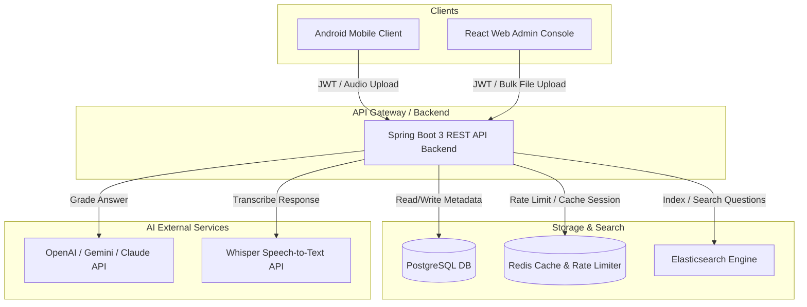

# Project Scope - AI-Powered Interview Preparation and Assessment Platform

## 1. Document Control
- **Project Name:** AI-Powered Interview Preparation and Assessment Platform
- **Document Version:** 1.0.0
- **Date:** 2026-06-11
- **Status:** Draft

## 2. Project Description & Objectives
The AI-Powered Interview Preparation and Assessment Platform is a decentralized, responsive ecosystem designed to help job seekers practice realistic technical interviews. 
- **Objectives:**
  - Standardize subdomain and department-based Q&A content ingestion.
  - Deliver dynamic, voice-enabled mock assessments on Android (target baseline API 26+).
  - Provide SRE-monitored, sub-10s latency AI evaluations based on predefined scoring metrics.

## 3. System Architecture Diagram

## 4. In-Scope Deliverables

### Phase 1: MVP (Weeks 1-4)
- **Ingestion Module:** Administrative ingestion engine processing PDF/DOCX/TXT files into Elasticsearch subdomains.
- **Mock Assessment Engine:** Core interview session controller orchestrating randomized question delivery.
- **Android App Core:** Login screen, selection settings, interactive mock assessment flow, Whisper STT integration.
- **Backend API Foundation:** Spring Security, JWT, PostgreSQL, Redis rate-limiting.

### Phase 2: Evaluation & Analytics (Weeks 5-6)
- **AI Evaluation Module:** Structured LLM grading triggers and PostgreSQL report storage.
- **Admin Dashboard Console:** React-based admin view displaying ingestion statuses and performance telemetry.
- **Analytics & History:** Candidates dashboard tracking historical mock scores.

## 5. Release Plan
- **MVP (v0.5)**: Release of core Android interactive voice-mock assessment and backend parser tools (Internal Alpha - Week 4).
- **v1.0 (Production Release)**: Fully integrated AI grading engine, Admin Web dashboard, telemetry alerts configuration (Week 6).
- **v1.1 (Performance Update)**: Native voice audio stream compression optimizations, custom subdomain tokenizers.
- **v2.0 (Scale & Enterprise)**: Automated cohort analysis, video analysis indicators, self-service admin templates.

## 6. Deployment Architecture
- **Frontend distribution:** Google Play Console (Android Client), AWS S3 + CloudFront (React Web Admin).
- **Backend hosting:** AWS ECS Fargate hosting stateless Spring Boot Docker containers.
- **Databases:** AWS RDS (PostgreSQL), AWS ElastiCache (Redis).
- **Alerting & Monitoring:** Grafana Cloud capturing Prometheus telemetry and Logback MDC structured logs.

## 7. RACI Matrix

| Deliverable | PM | Architect | Android Dev | Spring Boot Dev | QA | DevOps |
| :--- | :---: | :---: | :---: | :---: | :---: | :---: |
| DB / ES Schema Design | C | A | I | R | I | I |
| Bulk Ingestion Engine | I | A | I | R | R | I |
| Android Voice Client | C | A | R | C | R | I |
| AI Evaluation Pipeline | C | A | I | R | R | I |
| Infrastructure & Alerts | I | A | I | I | I | R |
| Quality Verification | I | I | C | C | R | I |

*Legend: R = Responsible, A = Accountable, C = Consulted, I = Informed*

## 8. Milestones & Timeline

| Milestone | Description | Target Date | Owner |
|-----------|-------------|-------------|-------|
| M1: Architecture Setup | Finalized database schemas, API specs, and workspace repositories | Week 1 | Architect |
| M2: Core Ingestion | Bulk QA file ingestion, parsing, and Elasticsearch indexing complete | Week 2 | Spring Boot Dev |
| M3: Mobile Alpha | Android Client voice capture, Whisper STT, and session builder operational | Week 4 | Android Dev |
| M4: AI Evaluation | Complete OpenAI/Gemini grading flow integrated with backend | Week 5 | Spring Boot Dev |
| M5: SRE Readiness | Prometheus alerts, rate limit thresholds, and SLA validation complete | Week 6 | DevOps |
| M6: Final Release | Production deployment and validation of walkthrough matrices | Week 6 | PM |
