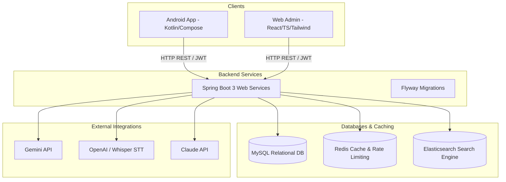

# Project Analysis: AI-Powered Interview Preparation and Assessment Platform

This document provides a detailed architectural overview, codebase structure breakdown, data/API flows, design systems, and expansion points for the AI-Powered Interview Preparation and Assessment Platform.

---

## 1. Project Architecture Overview

The platform is designed around a **decoupled, multi-client, service-oriented architecture** composed of three main systems:



### Key Architectural Pillars:
* **Stateless API Backend:** Built with Spring Boot 3, using REST endpoints to communicate with both the Android client (candidates) and the React console (administrators).
* **Database & Migrations:** Flyway manages schema evolution on a MySQL datasource (configured with dialect `MySQLDialect` and tables for users, configurations, sessions, and audits).
* **Caching & Search Indexing:** Redis is used for rate-limiting (OTP requests, API limits) and fast lookups of transient session states. Elasticsearch provides custom tokenizer indexing for question bank search.
* **AI Evaluation Engine:** Integrates external APIs (Gemini 2.5 Flash, OpenAI Whisper, Claude) to convert voice responses to text and perform rubric-based grading against expected answers.

---

## 2. Folder Structure Explanation

The codebase is split into three main top-level directories:

```text
Ai_Powered_Interview_Prep_Platform/
├── android-app/                   # Android Mobile Client (Candidate App)
├── backend/                       # Spring Boot 3 Backend API Services
└── frontend-react-admin_new/      # React Web Admin Console
```

### Backend (`/backend`)
Follows a modular structure where each business feature is represented by a specific package prefixed with `modXX_`:
* `src/main/java/com/interview/platform/`
  * `config/`: Application configurations (Security, CORS, Redis).
  * `exception/`: Global Exception Handler mapping domains to standard HTTP error DTOs.
  * `filter/`: JWT Request validation filters.
  * `mod01_authentication/`: Candidate OTP & Admin credentials authentication.
  * `mod03_department_management/` & `mod04_technology_management/`: Tech hierarchy mapping.
  * `mod06_question_repository/` & `mod07_bulk_upload/`: Question ingestion pipelines.
  * `mod10_interview_session/` & `mod11_question_delivery/`: Session state machine.
  * `mod13_speech_to_text/` & `mod14_ai_evaluation/`: Integration with Whisper/LLMs.
  * `mod22_audit_logs/`: Entity modification tracking.
  * `mod26_ai_prompt_management/`: Management of prompt versions and models.

### Frontend Web Admin (`/frontend-react-admin_new`)
Uses a modern React 19 + TypeScript layout optimized with Vite:
* `src/`
  * `components/`: Core UI templates (Buttons, Modals) and layout wrappers.
  * `features/`: Contains feature modules matching backend prefixes (e.g. `mod01_authentication/services`).
  * `layouts/`: Core frames like `AdminLayout` containing Header & Sidebar.
  * `pages/`: Individual routed panels (e.g., `Admin_Login`, `Question_Dashboard`).
  * `services/http/`: Axios HTTP Client configuration with token interception.

### Android Client (`/android-app`)
Implements Clean Architecture principles split by layers:
* `app/src/main/java/com/interview/platform/`
  * `data/`: Local/Remote data sources.
    * `remote/api/`: Retrofit API declarations mapping to modules (e.g., `Mod01AuthenticationApiService`).
    * `local/dao/` & `local/entity/`: Room database components.
  * `di/`: Hilt Dependency Injection modules (NetworkModule, DataModule).
  * `domain/`: Business entities and repository definitions.
  * `ui/`: View layers.
    * `screens/`: Compose UI files grouped by module number (e.g. `mod01_authentication/login/LoginScreenViewModel`).
    * `navigation/`: AppNavHost and routes.

---

## 3. Existing Modules and Features

| Module ID | Module Name | Core Features | Key Code Symbols |
| :--- | :--- | :--- | :--- |
| **MOD-01** | Authentication | Candidate OTP validation; Admin JWT credential login; Session refresh | [AdminUserController](file:///d:/cross-project/Ai_Powered_Interview_Prep_Platform/backend/src/main/java/com/interview/platform/mod01_authentication/AdminUserController.java), [OtpLoginService](file:///d:/cross-project/Ai_Powered_Interview_Prep_Platform/backend/src/main/java/com/interview/platform/mod01_authentication/OtpLoginService.java) |
| **MOD-03** | Department Management | Organization/Department mapping (Mobile, Backend, Frontend) | [DepartmentManagement](file:///d:/cross-project/Ai_Powered_Interview_Prep_Platform/frontend-react-admin_new/src/pages/Department_Management.tsx) |
| **MOD-06** | Question Repository | Core question storage; difficulty and taxonomy categorization | [QuestionRepository](file:///d:/cross-project/Ai_Powered_Interview_Prep_Platform/frontend-react-admin_new/src/pages/Question_Repository.tsx) |
| **MOD-07** | Bulk Upload Center | Parse PDF/DOCX to automatically ingest questions via AI extraction | [BulkUploadCenter](file:///d:/cross-project/Ai_Powered_Interview_Prep_Platform/frontend-react-admin_new/src/pages/Bulk_Upload_Center.tsx) |
| **MOD-10** | Interview Session | Active session tracking, overall scoring, candidate state management | [InterviewSessionService](file:///d:/cross-project/Ai_Powered_Interview_Prep_Platform/backend/src/main/java/com/interview/platform/mod10_interview_session/InterviewSessionService.java) |
| **MOD-14** | AI Evaluation Engine | Sends responses to LLMs (Gemini) to evaluate strengths, weaknesses, and scores | [AiPromptManagementService](file:///d:/cross-project/Ai_Powered_Interview_Prep_Platform/backend/src/main/java/com/interview/platform/mod26_ai_prompt_management/AiPromptManagementService.java) |
| **MOD-19** | Recommendation | Dynamic generation of roadmap templates, badges, and learning topics | [V8__create_user_roadmaps_table.sql](file:///d:/cross-project/Ai_Powered_Interview_Prep_Platform/backend/src/main/resources/db/migration/V8__create_user_roadmaps_table.sql) |
| **MOD-22** | Audit Logs | Logging administrative overrides and modifications as system audit trails | [V2__init_consolidated_schema.sql](file:///d:/cross-project/Ai_Powered_Interview_Prep_Platform/backend/src/main/resources/db/migration/V2__init_consolidated_schema.sql#L236-L244) |

---

## 4. API Integration Flow

API communications are fully standardized under REST endpoints communicating via JSON structures.

### Web Admin Token Interceptor Flow:

```mermaid
sequenceDiagram
    participant UI as Page Component
    participant Axios as Axios Client
    participant API as Spring Boot Backend
    
    UI->>Axios: Request User List (GET /api/v1/users)
    Note over Axios: Attach Bearer Token<br/>from LocalStorage
    Axios->>API: Send Request
    alt Token is valid
        API-->>Axios: 200 OK (User Data)
        Axios-->>UI: Return Data
    else Token is expired (401 Unauthorized)
        API-->>Axios: 401 Unauthorized
        Note over Axios: Trigger response interceptor
        Axios->>API: POST /api/v1/auth/token/refresh (with refresh token)
        alt Refresh success
            API-->>Axios: 200 OK (New access token)
            Note over Axios: Store new token; retry original request
            Axios->>API: GET /api/v1/users (with new token)
            API-->>Axios: 200 OK (User Data)
            Axios-->>UI: Return Data
        else Refresh fails
            Note over Axios: Clear tokens; Redirect to /login
            Axios-->>UI: Return Auth Failure
        end
    end
```

---

## 5. State Management Flow

### Web Admin Portal:
1. **API State:** Managed by **TanStack React Query** (`@tanstack/react-query`). Caches API responses and handles optimistic updates and mutation statuses.
2. **UI State:** Local components manage transient states (menu toggles, form entries) via `useState` and `useContext`.
3. **Template Store:** Redux Toolkit package is present, but not active/in-use in the main React application tree.

### Android Client:
1. **Jetpack Compose Integration:** Exposes states as reactive streams via `StateFlow` and `MutableStateFlow` from ViewModels.
2. **Persistent Storage:** Jetpack DataStore manages user login credentials, tokens, and local configuration choices in `UserPreferencesRepository`.
3. **Local DB Cache:** Planned via Room DAOs, though not yet wired to a central database builder database class.

---

## 6. Reusable Components Inventory

### Web Admin (`src/components`):
* **UI Atom Components:**
  * `Badge`: Dynamic badge styling for status pill views (e.g. active, pending).
  * `Button`: Standard theme-driven buttons (outline, primary color).
  * `Card`: Material Card layout for dashboard items.
  * `Modal`: Universal overlay popup container.
  * `ToastProvider`: Visual alerts (powered by `react-hot-toast`).
* **Shared Layout Components:**
  * `DataTable`: Generic reusable table with pagination, filtering, and row headers.
  * `PageHeader`: Title layout with action buttons.
  * `StatCard`: Visual metrics block showing counts, charts, or percentages.

### Android Client (`src/ui/components`):
* Composable elements providing buttons, text inputs, loading spinners, and card panels, adhering to Material 3 tokens.

---

## 7. Navigation and Routing Flow

### Web Admin Routing:
Uses **React Router DOM v7** to structure the app layout:
* **Public Routes:** `/login`, `/otp`, `/forgot-password`.
* **Protected Routes:** wrapped inside [ProtectedRoute](file:///d:/cross-project/Ai_Powered_Interview_Prep_Platform/frontend-react-admin_new/src/components/ProtectedRoute.tsx) which enforces authentication and nests them in [AdminLayout](file:///d:/cross-project/Ai_Powered_Interview_Prep_Platform/frontend-react-admin_new/src/layouts/AdminLayout.tsx).
* Layout uses a persistent [Sidebar](file:///d:/cross-project/Ai_Powered_Interview_Prep_Platform/frontend-react-admin_new/src/components/Sidebar.tsx) and [Header](file:///d:/cross-project/Ai_Powered_Interview_Prep_Platform/frontend-react-admin_new/src/components/Header.tsx).

### Android Navigation:
Managed via Compose `NavHost` in [AppNavHost.kt](file:///d:/cross-project/Ai_Powered_Interview_Prep_Platform/android-app/app/src/main/java/com/interview/platform/ui/navigation/AppNavHost.kt) mapping routes in [AppRoutes.kt](file:///d:/cross-project/Ai_Powered_Interview_Prep_Platform/android-app/app/src/main/java/com/interview/platform/ui/appRoutes.kt):
* Entry: `splash` -> `welcome` -> `login` -> `otp/{email}`.
* Setup: `departmentSelection` -> `technologySelection` -> `experienceSelection` -> `questionCountSelection`.
* Core flow: `interviewSession` -> `voiceRecording`/`speechToText` -> `interviewCompleted` -> `interviewSummary`.
* Learn: `interviewRoadmap` -> `learningTopic/{roadmapId}/{topicName}`.

---

## 8. Design System and Theme Usage

### Tailwind CSS v4 Theme Configuration:
The React app uses the new Tailwind CSS v4 `@theme` configuration within [index.css](file:///d:/cross-project/Ai_Powered_Interview_Prep_Platform/frontend-react-admin_new/src/index.css):
* **Colors:** Extracted from Material Design 3 guidelines (e.g. `--color-primary: #006b2c`, `--color-background: #f8f9ff`, `--color-surface-container: #e5efff`).
* **Typography:** Set to Outfit / Inter typography with responsive line-height adjustments.
* **Layout tokens:** Enforces standardized gutters (`--spacing-gutter: 24px`), sidebar sizes (`--spacing-sidebar-width: 260px`), and page containers.

### Android Theme:
Configured under `ui/theme/` utilizing Material 3 Composable themes. Exposes dynamic light/dark palettes synchronized with the candidate's OS system theme.

---

## 9. Potential Extension Points

1. **Room Database Integration (Android):**
   * *Status:* Entities and DAOs are fully created, but no centralized `RoomDatabase` class or Hilt provider for `AppDatabase` is implemented.
   * *Next Step:* Create `AppDatabase.kt`, register all 17 DAOs, and expose the database instance via `DataModule.kt`.
2. **WebSocket Notifications (MOD-21):**
   * *Status:* Notification channels are currently REST-driven polling/mock placeholders.
   * *Next Step:* Integrate Spring WebSockets (Stomp/MQTT) to deliver real-time notifications when AI evaluation finishes or roadmaps are updated.
3. **Redux Store Wiring (Web Admin):**
   * *Status:* Redux Toolkit is imported in `package.json` with slices defined, but the application root does not import `react-redux` Providers.
   * *Next Step:* If global client state increases (e.g. offline queues, persistent configurations), create `store.ts` and wrap `App.tsx` with `<Provider store={store}>`.
4. **Enhanced Media Streaming & Uploads:**
   * *Status:* Speech-to-text uses file-based posting.
   * *Next Step:* Enable streaming WebRTC audio from Android directly to backend Whisper integration for live transcriptions.
